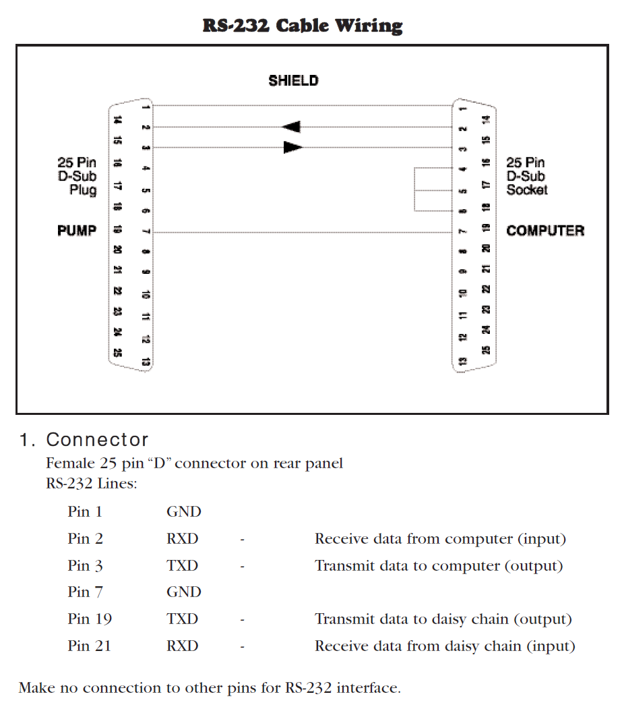

# Serial Ports! Physically Connecting to the Pumps #

Remember [serial ports](https://en.wikipedia.org/wiki/Serial_port)? It has certainly been a while since computers shipped with a [DE-9  connector](https://en.wikipedia.org/wiki/D-subminiature). A quick Google search suggests that around 2004 these connectors and the accompanying serial connection were no longer being installed on computers.

This means that in order to connect to a serial interface running the RS-232 (or similar) communication protocol, an adapter for the computer will be needed. Fortunately, USB to serial adapters are readily available online. 

The Model 22 has a DB25 connector. Although I associate the DB25 connector with a parallel port, a quick Google search suggests that DB25 ports were used as serial ports until [around the mid 1980s](https://superuser.com/questions/547374/is-db-25-port-serial-or-parallel).

The Model 44 switched to using a RJ11/RJ12 connector (i.e., a phone cord input). Note, this should not be confused with the RJ45 (ethernet) connector, which is slightly larger. As only 4 channels are used, needed, technically a RJ11 is fine, but the form factor is the same for a RJ12 and when buying online sometimes you'll see RJ12 equipment, which is sufficient. The RJ12 is the same form factor as the RJ11, except that it has 6 wires instead of the RJ11's 4.

## Model 44/ PhD 2000 pumps ##

## Model 22 ##

T

It is not clear to me if there is a standard DB25 RS-232 connector. There appears to be multiple versions. 

The Harvard pumps 

The Model 44 has a RJ11 connector input (phone line). However, a phone line is probably also a good choice in general for an inexpensive 4 conductor wire running a good length. Based on this I'll provide some suggestions and then add some extra thoughts on possible alternatives.

https://www.amazon.com/Female-Modular-Connector-Serial-Adapters/dp/B07PQDCSVC